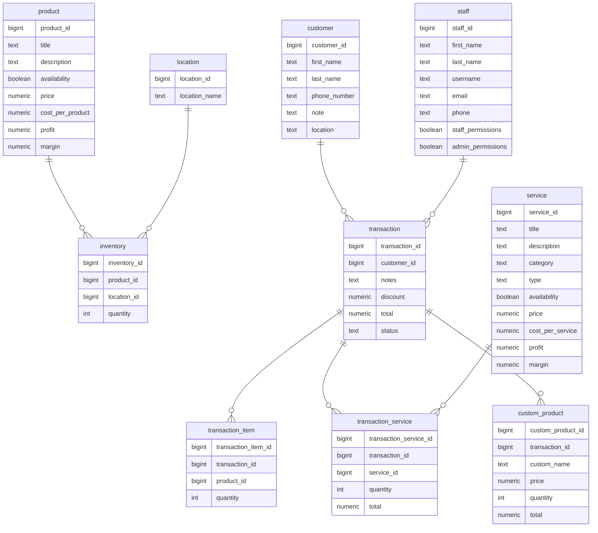

<p align="center">
  <a href="https://github.com/aidrecabrera/docs-chuan">
    
  </a>
</p>

<h1 align="center" >
  Chuan Specialized System
</h1>

<div align="center">
<a href="https://www.facebook.com/chuanspaDigosCity/">
    
</a>
<a href="https://aidrecabrera-portfolio.vercel.app">
    
</a>
<a href="https://github.com/aidrecabrera/docs-chuan/">
    
</a>
</div>

# Problem
### Background
Chuan Spa Clinic is a business offering spa services and products. Their operations involve various aspects such as booking, billing, inventory management, employee management, reporting, and loyalty incentives. Currently, these operations might be manual or fragmented across different systems, leading to inefficiencies and potential errors.

### The Problem
- The current manual or fragmented systems for managing daily transactions, employee management, inventory tracking, reporting, and loyalty incentives can lead to inefficiencies, errors, and difficulties in scaling the business. This lack of automation and integration hampers productivity and can affect the overall customer experience.
- Efficient management of operations directly impacts the user experience. Streamlining processes such as booking, billing, and inventory management can lead to faster service delivery and improved customer satisfaction. Additionally, accurate reporting and analytics enable informed decision-making, while loyalty incentives can enhance customer retention.
- An analysis of current processes may reveal instances of inefficiencies, errors, or delays. Customer feedback, employee input, and operational metrics such as booking times, inventory turnover, and employee productivity can provide evidence of areas needing improvement.

### Our Approach
The solution involves developing a comprehensive cloud-based POS system tailored for Chuan Spa Clinic. This system will automate and streamline operations such as booking, billing, inventory management, employee management, reporting, and loyalty incentives. Integration with existing systems and platforms will ensure smooth transitions and minimal disruptions.

# Goals & Success
- **What are the goals?**
    - Automate and streamline daily operations
    - Improve efficiency and accuracy in transactions and reporting
    - Enhance customer experience and loyalty
    - Enable scalability for potential expansion to multiple branches
- **How do we define success and what metrics will we use to measure it?**
    - Reduction in transaction processing time
    - Decrease in errors or discrepancies in billing and inventory management
    - Increase in customer satisfaction scores
    - Growth in loyalty program participation
    - Ability to seamlessly scale operations to accommodate business expansion

# Solution
### Features
1. **Booking Management**: Allow customers to book appointments online, with real-time availability updates.
2. **Billing Integration**: Integrate payment gateways for secure and seamless transactions.
3. **Inventory Tracking**: Track inventory levels in real-time, automate reordering processes.
4. **Employee Management**: Manage schedules, track performance, and handle payroll.
5. **Reporting and Analytics**: Generate customized reports on sales, inventory, and employee performance.
6. **Loyalty Incentives**: Implement a loyalty program with rewards and incentives for repeat customers.
7. **Scalability**: Design the system architecture to accommodate potential expansion to multiple branches.
8. **Security and Compliance**: Implement robust security measures to protect customer data and ensure compliance with regulations.

### Technical Architecture
- **Data Model**: Design a comprehensive data model to capture and organize information related to bookings, billing, inventory, employees, customers, and transactions.
- **System Architecture**: Implement a scalable and resilient system architecture leveraging cloud infrastructure to ensure high availability, reliability, and performance.

### Open and Closed Questions
- **What remains to be discussed?**
    - Specific requirements for each feature
    - Integration points with existing systems
    - Timeline and milestones for development and deployment
    - Training and support for staff during and after implementation
- **What have we already discussed and decided on?**
    - Choice of starting technologies: React, Supabase, and TailwindCSS
    - High-level features and recommendations for enhancing functionality
    - Goals and metrics for measuring success
    - Importance of scalability and security in the system architecture


# Database System Design

## PostgreSQL Schema
```sql
CREATE TABLE customers (
    customer_id SERIAL PRIMARY KEY,
    first_name VARCHAR(50) NOT NULL,
    last_name VARCHAR(50) NOT NULL,
    phone_number VARCHAR(20),
    note TEXT,
    location VARCHAR(100)
);

CREATE TABLE transactions (
    transaction_id SERIAL PRIMARY KEY,
    customer_id INT REFERENCES customers(customer_id),
    notes TEXT,
    discount DECIMAL(10, 2),
    total DECIMAL(10, 2),
    status VARCHAR(10) CHECK (status IN ('Paid', 'Due'))
);

CREATE TABLE transaction_items (
    transaction_item_id SERIAL PRIMARY KEY,
    transaction_id INT REFERENCES transactions(transaction_id),
    product_id INT REFERENCES products(product_id),
    quantity INT
);

CREATE TABLE transaction_services (
    transaction_service_id SERIAL PRIMARY KEY,
    transaction_id INT REFERENCES transactions(transaction_id),
    service_id INT REFERENCES services(service_id),
    quantity INT,
    total DECIMAL(10, 2)
);

CREATE TABLE custom_products (
    custom_product_id SERIAL PRIMARY KEY,
    transaction_id INT REFERENCES transactions(transaction_id),
    custom_name VARCHAR(100),
    price DECIMAL(10, 2),
    quantity INT,
    total DECIMAL(10, 2)
);

CREATE TABLE services (
    service_id SERIAL PRIMARY KEY,
    title VARCHAR(100),
    description TEXT,
    category VARCHAR(50),
    type VARCHAR(50),
    availability BOOLEAN,
    price DECIMAL(10, 2),
    cost_per_service DECIMAL(10, 2),
    profit DECIMAL(10, 2),
    margin DECIMAL(5, 2)
);

CREATE TABLE products (
    product_id SERIAL PRIMARY KEY,
    title VARCHAR(100),
    description TEXT,
    availability BOOLEAN,
    price DECIMAL(10, 2),
    cost_per_product DECIMAL(10, 2),
    profit DECIMAL(10, 2),
    margin DECIMAL(5, 2)
);

CREATE TABLE locations (
    location_id SERIAL PRIMARY KEY,
    location_name VARCHAR(100)
);

CREATE TABLE inventory (
    inventory_id SERIAL PRIMARY KEY,
    product_id INT REFERENCES products(product_id),
    location_id INT REFERENCES locations(location_id),
    quantity INT,
    CONSTRAINT unique_product_location UNIQUE (product_id, location_id)
);

CREATE TABLE staff (
    staff_id SERIAL PRIMARY KEY,
    first_name VARCHAR(50) NOT NULL,
    last_name VARCHAR(50) NOT NULL,
    username VARCHAR(50) UNIQUE,
    email VARCHAR(100) UNIQUE,
    phone VARCHAR(20),
    staff_permissions BOOLEAN,
    admin_permissions BOOLEAN
);
```
---
## Transactions

### Transactions Table

| Field         | Description                                             |
|---------------|---------------------------------------------------------|
| TransactionID | Unique identifier for each transaction.                |
| CustomerID    | Identifier linking this transaction to a customer.      |
| Notes         | Additional notes about the transaction.                |
| Discount      | Any discount applied to the transaction.               |
| Total         | Total amount of the transaction.                       |
| Status        | Status of the transaction ('Paid' or 'Due').           |

### What to Input:

#### Transaction Information
- Customer: Select or input the customer associated with the transaction.
- Notes: Add any additional notes or comments related to the transaction.

#### Item List
- Each list has:
    - Product Information (From the products): Select or input the product details.
    - Quantity: Enter the quantity of each product included in the transaction.

#### Service List
- Each list has:
    - Service Information (From the services): Select or input the service details.
    - Quantity: Enter the quantity of each service included in the transaction.
    - Total: The total price for each service in this transaction.

#### Custom Product
- Custom Name: Enter the name of the custom product.
- Price: Specify the price of the custom product.
- Quantity: Enter the quantity of the custom product in this transaction.
- Total: The total price for the custom product in this transaction.

#### Payment (For all products that are added in the transaction)
- Discount: Specify any discount applied to the transaction.
- Total: The total amount to be paid for the transaction.
- Status (Paid, Due): Select the status of the transaction, whether it's 'Paid' or 'Due'.

---

## Customers

### Customers Table

| Field         | Description                                             |
|---------------|---------------------------------------------------------|
| CustomerID    | Unique identifier for each customer.                    |
| FirstName     | First name of the customer.                             |
| LastName      | Last name of the customer.                              |
| PhoneNumber   | Phone number of the customer.                           |
| Note          | Additional notes about the customer.                   |
| Location      | Location where the customer is associated.             |

### What to Input:

#### Customer Overview
- First Name: Enter the first name of the customer.
- Last Name: Enter the last name of the customer.
- Phone Number: Enter the phone number of the customer.
- Note (Notes are private and won't be shared with the customer.): Add any relevant notes about the customer.
- Location (What location they are.): Specify the location associated with the customer.

---

## Service

### Services Table

| Field             | Description                                             |
|-------------------|---------------------------------------------------------|
| ServiceID         | Unique identifier for each service.                      |
| Title             | Title of the service.                                    |
| Description       | Description of the service.                              |
| Category          | Category of the service.                                 |
| Type              | Type of the service.                                     |
| Availability      | Availability status of the service.                      |
| Price             | Selling price of the service.                            |
| CostPerService    | Cost incurred for providing the service.                 |
| Profit            | Profit margin for the service.                           |
| Margin            | Profit margin percentage.                                |

### What to Input:

#### Service Information
- Title: Enter the title of the service.
- Description: Provide a brief description of the service.
- Category: Specify the category to which the service belongs.
- Type: Specify the type of the service.
- Availability: Indicate whether the service is available or not.

#### Service Pricing
- Price: Specify the selling price of the service.
- Cost per product: Enter the cost incurred for providing each unit of the service.
- Profit: Specify the profit margin for the service.
- Margin: Enter the profit margin percentage.

---

## Item

### Products Table

| Field             | Description                                             |
|-------------------|---------------------------------------------------------|
| ProductID         | Unique identifier for each product.                      |
| Title             | Title of the product.                                    |
| Description       | Description of the product.                              |
| Availability      | Availability status of the product.                      |
| Price             | Selling price of the product.                            |
| CostPerProduct    | Cost incurred for each unit of the product.              |
| Profit            | Profit margin for the product.                           |
| Margin            | Profit margin percentage.                                |

### What to Input:

#### Item Information
- Title: Enter the title of the product.
- Description: Provide a brief description of the product.
- Availability: Indicate whether the product is available or not.

#### Item Pricing
- Price: Specify the selling price of the product.
- Cost per product: Enter the cost incurred for each unit of the product.
- Profit: Specify the profit margin for the product.
- Margin: Enter the profit margin percentage.

#### Item Inventory
- Add Locations (Configure what locations must be added for stock): Specify the locations where the product is stored.
- Quantity (If multiple locations, each location quantity must be given): Enter the quantity of the product available at each specified location.

---

## Locations

### Locations Table

| Field         | Description                                             |
|---------------|---------------------------------------------------------|
| LocationID    | Unique identifier for each location.                    |
| LocationName  | Name of the location.                                   |

---

## Inventory

| Field        | Description                                             |
|--------------|---------------------------------------------------------|
| InventoryID  | Unique identifier for each inventory entry.             |
| ProductID    | Identifier linking this entry to a product.            |
| LocationID   | Identifier linking this entry to a location.           |
| Quantity     | Quantity of the product available at the specified location. |

### What to Input:

- InventoryID: Automatic unique identifier (if applicable).
- ProductID: Link to the product associated with the inventory entry.
- LocationID: Link to the location where the product is stored.
- Quantity: Enter the quantity of the product available at the specified location.

---

## Staff

### Staff Table

| Field            | Description                                             |
|------------------|---------------------------------------------------------|
| StaffID          | Unique identifier for each staff member.                |
| FirstName        | First name of the staff member.                         |
| LastName         | Last name of the staff member.                          |
| Username         | Username used for login.                                 |
| Email            | Email address of the staff member.                       |
| Phone            | Phone number of the staff member.                       |
| StaffPermissions | Boolean indicating whether the staff has staff-level permissions. |
| AdminPermissions | Boolean indicating whether the staff has admin-level permissions. |

### What to Input:

#### Adding Staff
- Contact Information
    - First Name: Enter the first name of the staff member.
    - Last Name: Enter the last name of the staff member.
    - Username: Enter the username used for login.
    - Email: Enter the email address of the staff member.
    - Phone: Enter the phone number of the staff member.
- System Access
    - Permissions
        - Staff Permissions: Select or specify if the staff member has staff-level permissions.
        - Admin Permissions: Select or specify if the staff member has admin-level permissions.
---

# User Flows & Mocks

The system design depicted in the provided images appears to be inspired by Shopify POS (Point of Sale). Shopify POS is a system designed to facilitate retail transactions, inventory management, and customer engagement in physical retail environments. It provides a comprehensive platform for businesses to manage sales, accept payments, track inventory, and analyze customer data.

---

---

---
