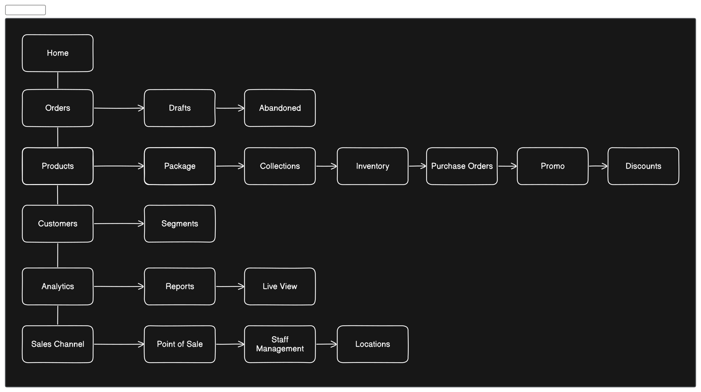
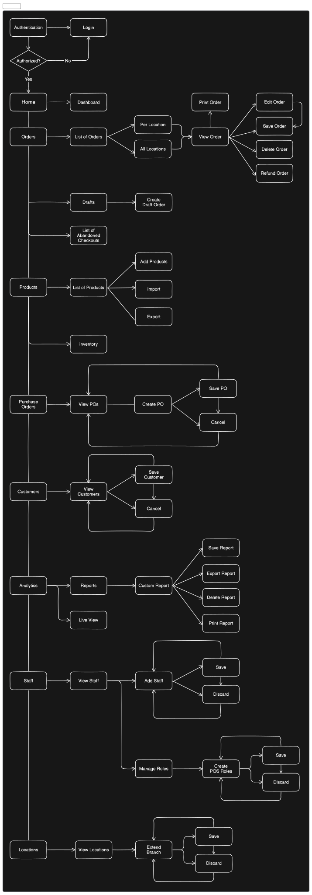

  

<h1 align="center" >
  Chuan Specialized System
</h1>

# Problem
### Background
Chuan Spa Clinic is a business offering spa services and products. Their operations involve various aspects such as booking, billing, inventory management, employee management, reporting, and loyalty incentives. Currently, these operations might be manual or fragmented across different systems, leading to inefficiencies and potential errors.

### The Problem
- The current manual or fragmented systems for managing daily transactions, employee management, inventory tracking, reporting, and loyalty incentives can lead to inefficiencies, errors, and difficulties in scaling the business. This lack of automation and integration hampers productivity and can affect the overall customer experience.
- Efficient management of operations directly impacts the user experience. Streamlining processes such as booking, billing, and inventory management can lead to faster service delivery and improved customer satisfaction. Additionally, accurate reporting and analytics enable informed decision-making, while loyalty incentives can enhance customer retention.
- An analysis of current processes may reveal instances of inefficiencies, errors, or delays. Customer feedback, employee input, and operational metrics such as booking times, inventory turnover, and employee productivity can provide evidence of areas needing improvement.

### Our Approach
The solution involves developing a comprehensive cloud-based POS system tailored for Chuan Spa Clinic. This system will automate and streamline operations such as booking, billing, inventory management, employee management, reporting, and loyalty incentives. Integration with existing systems and platforms will ensure smooth transitions and minimal disruptions.

# Goals & Success
- **What are the goals?**
    - Automate and streamline daily operations
    - Improve efficiency and accuracy in transactions and reporting
    - Enhance customer experience and loyalty
    - Enable scalability for potential expansion to multiple branches
- **How do we define success and what metrics will we use to measure it?**
    - Reduction in transaction processing time
    - Decrease in errors or discrepancies in billing and inventory management
    - Increase in customer satisfaction scores
    - Growth in loyalty program participation
    - Ability to seamlessly scale operations to accommodate business expansion

# Solution
### Features
1. **Booking Management**: Allow customers to book appointments online, with real-time availability updates.
2. **Billing Integration**: Integrate payment gateways for secure and seamless transactions.
3. **Inventory Tracking**: Track inventory levels in real-time, automate reordering processes.
4. **Employee Management**: Manage schedules, track performance, and handle payroll.
5. **Reporting and Analytics**: Generate customized reports on sales, inventory, and employee performance.
6. **Loyalty Incentives**: Implement a loyalty program with rewards and incentives for repeat customers.
7. **Scalability**: Design the system architecture to accommodate potential expansion to multiple branches.
8. **Security and Compliance**: Implement robust security measures to protect customer data and ensure compliance with regulations.

# User Flows & Mocks

The system design depicted in the provided images appears to be inspired by Shopify POS (Point of Sale). Shopify POS is a system designed to facilitate retail transactions, inventory management, and customer engagement in physical retail environments. It provides a comprehensive platform for businesses to manage sales, accept payments, track inventory, and analyze customer data.
---

---

---
### Technical Architecture
- **Data Model**: Design a comprehensive data model to capture and organize information related to bookings, billing, inventory, employees, customers, and transactions.
- **System Architecture**: Implement a scalable and resilient system architecture leveraging cloud infrastructure to ensure high availability, reliability, and performance.

### Open and Closed Questions
- **What remains to be discussed?**
    - Specific requirements for each feature
    - Integration points with existing systems
    - Timeline and milestones for development and deployment
    - Training and support for staff during and after implementation
- **What have we already discussed and decided on?**
    - Choice of starting technologies: React, Supabase, and TailwindCSS
    - High-level features and recommendations for enhancing functionality
    - Goals and metrics for measuring success
    - Importance of scalability and security in the system architecture